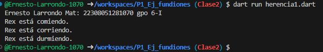

crear una clase anima con los atributos id_animal, nombre y raza) y para una función comer(), crear otra clase perro con herencia animal con las funciones correr() y otra dormir(). lenguaje dart.

salida de resultados

