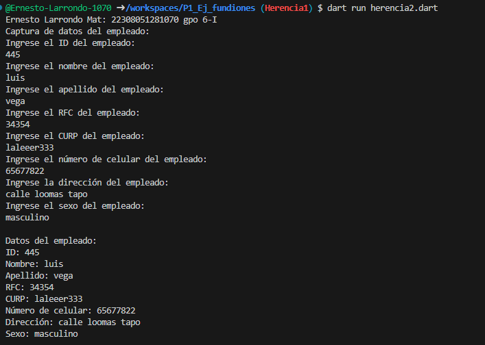

crear la clase Empleados con los atributos(id_Empleado, nombre, Apellido, RFC, CURP, Num_celular, Dirección y sexo) con una funcion capturardatos(), con interacción de interfaz de usuario. crea la clase DatosEmpleados con herencia Empleados y una funcion mostrarDatos(). Crear otra clase proveedor con los atributos(id_prove,  num_venta, Cant_producto, peso, tipo_prod y direccion) con otra funcion capturardatos(), con interacción de interfaz de usuario. Lenguaje dart

Tabla1

Tabla2

