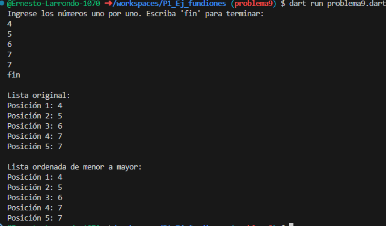

9. Escribe un programa que tome una lista de números enteros 
(int) y la ordene de menor a mayor y utilize dos funciones una 
para capturar datos de la lista y otra para mostrar los elementos.

Resultados:
